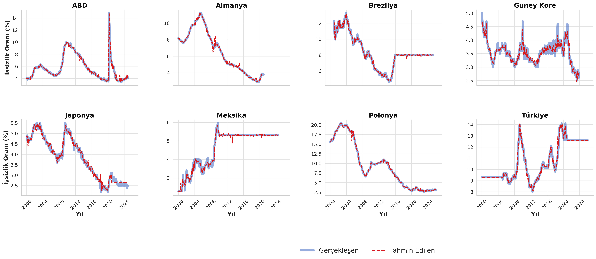
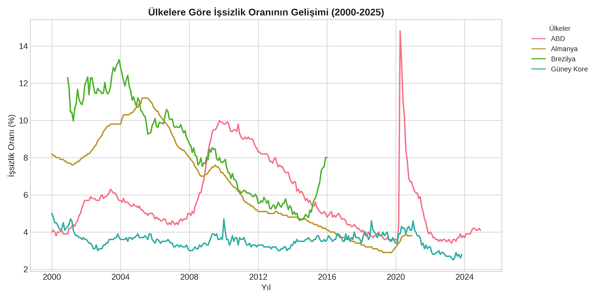
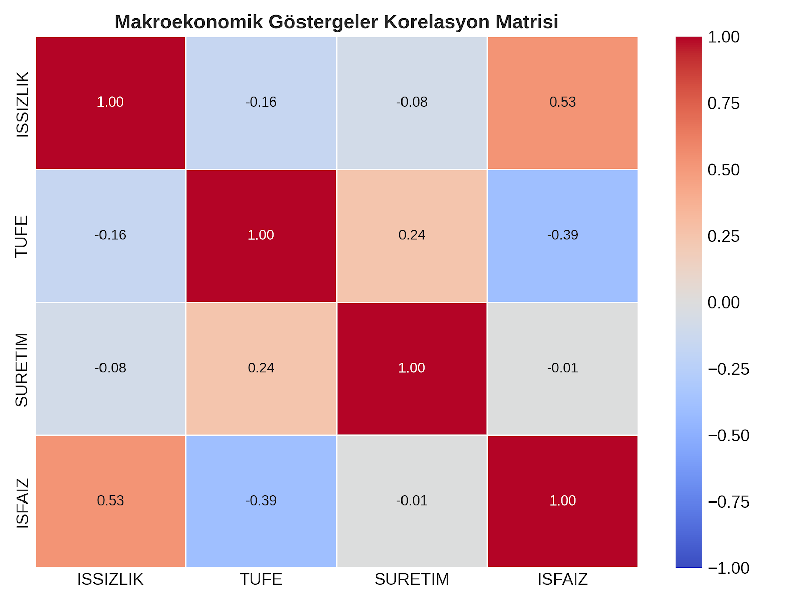

# 📈 Macroeconomic Unemployment Rate Prediction with XGBoost

An empirical machine learning and econometric panel data study evaluating non-linear relationships between macroeconomic aggregates (CPI, Industrial Production, Discount Rate) and national unemployment rates across 8 structurally diverse economies (2000–2024)[cite: 5].

---

## 📌 Research Overview & Core Findings
> **Core Hypothesis:** Is national unemployment driven primarily by universal macroeconomic rules or by country-specific structural institutions?[cite: 5]

* **Exceptional Predictive Accuracy:** A hyperparameter-optimized XGBoost regression pipeline captured non-linear structural shocks across economies, achieving an **$R^2$ of 0.99**, an **MAE of 0.17**, and an **RMSE of 0.28** on test splits[cite: 5].
* **Empirical Feature Attribution:** Country dummy variables (Poland, South Korea, Turkey) dominated feature importance rankings, proving that localized structural dynamics and labor institutional flexibility outweigh universal aggregates like CPI and Industrial Production in explaining employment variance[cite: 5].

---

## 📊 Benchmark & Evaluation Results

| Metric | Score | Description |
| :--- | :---: | :--- |
| **Coefficient of Determination ($R^2$)** | **0.99** | Explains 99% of total variance across multi-country panel observations[cite: 5] |
| **Mean Absolute Error (MAE)** | **0.17** | Average absolute deviation of predicted unemployment rate[cite: 5] |
| **Root Mean Squared Error (RMSE)** | **0.28** | Penalized error metric for large idiosyncratic forecasting outliers[cite: 5] |

### Hyperparameter Configuration
* `learning_rate`: 0.05[cite: 5]
* `n_estimators`: 1,000[cite: 5]
* `max_depth`: 6[cite: 5]
* `subsample`: 0.80[cite: 5]
* `colsample_bytree`: 0.80[cite: 5]
* `early_stopping_rounds`: 50[cite: 5]

---

## 📉 Visualizations & Results

### 1. Actual vs. Predicted Unemployment (Across 8 Countries)
Ground truth historical rates vs. model predictions across divergent economic trajectories[cite: 5]:


### 2. Feature Importance (Information Gain)
Dominance of country-specific fixed effects over universal macroeconomic aggregates[cite: 5]:


### 3. Macroeconomic Correlation Matrix
Correlation heatmap between unemployment, discount rates, industrial output, and inflation[cite: 5]:


---

## 📁 Dataset Details
* **Source:** Federal Reserve Bank of St. Louis (FRED)[cite: 5]
* **Time Span:** Monthly panel data from 2000 to 2024[cite: 5]
* **Countries (8):** USA, Germany, Brazil, South Korea, Japan, Mexico, Poland, Turkey[cite: 5]
* **Key Indicators:**
  * **Target:** `ISSIZLIK` (Unemployment Rate %)[cite: 5]
  * **Predictors:** 
    * `TUFE`: Consumer Price Index (CPI)[cite: 5]
    * `SURETIM`: Industrial Production Index[cite: 5]
    * `ISFAIZ`: Discount Rate (Investment Cost Proxy)[cite: 5]
    * Country-specific dummy encodings (One-Hot Encoded)[cite: 5]

---

## 📂 Repository Layout
```text
macroeconomic-unemployment-xgboost/
├── assets/
│   ├── actual_vs_predicted.png       # 8-country comparative time series plots
│   ├── feature_importance.png        # XGBoost information gain rankings
│   └── correlation_matrix.png        # Cross-indicator correlation heatmap
├── data/
│   ├── processed/
│   │   └── hepsi_bir_arada_ulkeler_verisi.csv # Cleaned & merged panel data
│   └── raw/                          # Country-level raw monthly CSVs from FRED
├── notebooks/
│   └── macroeconomic_analysis.ipynb  # End-to-end data processing, EDA & XGBoost modeling
├── reports/
│   └── Aleyna_Sahan_VeriAnalizi.pdf  # Full academic thesis documentation
├── requirements.txt                  # Python dependencies
└── README.md
```

---

## 🚀 Quick Setup & Usage

### 1. Installation
```bash
git clone [https://github.com/Aleyna-Sahan/macroeconomic-unemployment-xgboost.git](https://github.com/Aleyna-Sahan/macroeconomic-unemployment-xgboost.git)
cd macroeconomic-unemployment-xgboost
pip install -r requirements.txt
```

### 2. Model Training & Evaluation
```python
import xgboost as xgb
from sklearn.metrics import mean_absolute_error, r2_score, root_mean_squared_error

# Initialize optimized XGBoost Regressor
model = xgb.XGBRegressor(
    n_estimators=1000,
    learning_rate=0.05,
    max_depth=6,
    subsample=0.8,
    colsample_bytree=0.8,
    early_stopping_rounds=50,
    random_state=42
)

# Train on panel data
model.fit(X_train, y_train, eval_set=[(X_test, y_test)], verbose=False)

# Predict & evaluate
preds = model.predict(X_test)
print(f"R2: {r2_score(y_test, preds):.2f}")
print(f"MAE: {mean_absolute_error(y_test, preds):.2f}")
print(f"RMSE: {root_mean_squared_error(y_test, preds):.2f}")
```

---

## 👤 Author
* **Aleyna Şahan**
  * Undergraduate Project in Statistics and Computer Science [Bilecik Şeyh Edebali University][cite: 5]
  * Advisor: Prof. Dr. Serpil Türkyılmaz[cite: 5]
  * GitHub: [@Aleyna-Sahan](https://github.com/Aleyna-Sahan)
